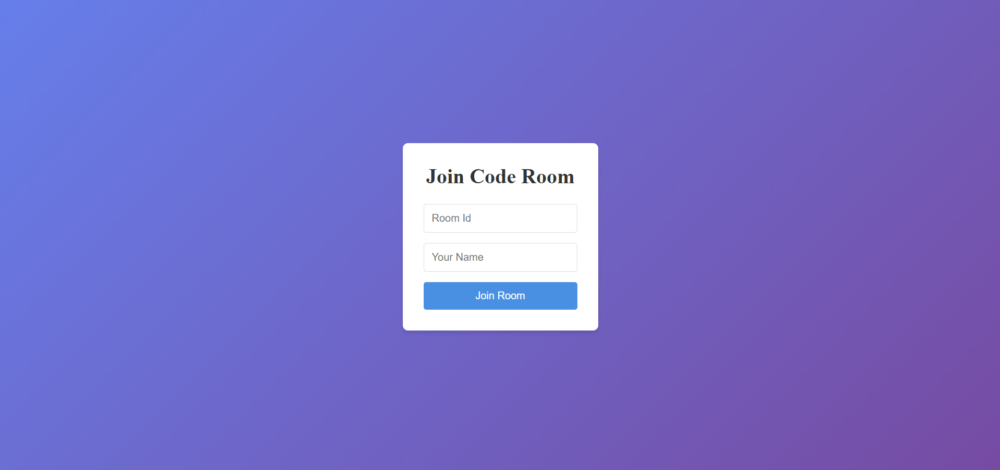

# CodeCollab: Real-Time Collaborative Code Editor


CodeCollab is a real-time collaborative code editor that allows developers to write and edit code together in various programming languages. Whether you're pair programming, teaching, or just collaborating on a project, CodeCollab makes it easy to code with friends and colleagues in real-time.

## 🌐 Live Demo

Experience CodeCollab in action: [https://realtime-code-editor-xxfx.onrender.com/](https://realtime-code-editor-xxfx.onrender.com/)

## ✨ Features

- 🚀 Real-time collaboration with multiple users
- 🌈 Support for multiple programming languages:
  - JavaScript
  - Python
  - Java
  - C++
- 👥 Multi-user editing with real-time updates
- 💬 User presence and typing indicators
- 🎨 Syntax highlighting with Monaco Editor
- 🔧 Language selection and code execution
- 📋 Easy room creation and joining with shareable room IDs

## 🛠️ Technologies Used

- Frontend:
  - React.js
  - Socket.IO Client
  - Monaco Editor
  - Vite (for building)
- Backend:
  - Node.js
  - Express.js
  - Socket.IO
- Deployment:
  - Render

## 🚀 Getting Started

### Using CodeCollab

1. Visit [https://realtime-code-editor-xxfx.onrender.com/](https://realtime-code-editor-xxfx.onrender.com/)
2. Enter a room ID and your name
3. Share the room ID with your collaborators
4. Start coding together in real-time!

### Running Locally (For Developers)

1. Clone the repository
   ```bash
   git clone https://github.com/SoumadeepGhosh/Realtime-Code-Editor.git
   cd codecollab
   ```

2. Install dependencies for both backend and frontend
   ```bash
   npm install
   cd frontend
   npm install
   cd ..
   ```

3. Start the development server
   ```bash
   npm run dev
   ```

4. In a separate terminal, start the frontend
   ```bash
   cd frontend
   npm run dev
   ```

5. Open your browser and visit `http://localhost:5173`

## 🖥️ Usage

1. Join or create a room by entering a room ID and your name
2. Select your preferred programming language
3. Start coding in the editor
4. Use the "Execute" button to run your code
5. View the output in the console below the editor
6. Collaborate with others in real-time

## 🤝 Contributing

Contributions, issues, and feature requests are welcome! Feel free to check [issues page](https://github.com/SoumadeepGhosh/Realtime-Code-Editor/issues).


## 👨‍💻 Author

**Soumadeep Ghosh**

- Github: [SoumadeepGhosh](https://github.com/SoumadeepGhosh)
- LinkedIn: [soumadeep-ghosh](https://www.linkedin.com/in/soumadeep-ghosh/)

## 🌟 Show your support

Give a ⭐️ if this project helped you!

## 📸 Screenshots




[Add more screenshots as needed]

## 🚀 Deployment

CodeCollab is deployed on [Render](https://render.com), a unified cloud to build and run all your apps and websites. The live version is always up to date with the latest features and improvements.

To deploy your own version of CodeCollab on Render:

1. Fork this repository to your GitHub account.
2. Create a new Web Service on Render.
3. Connect your GitHub account and select the CodeCollab repository.
4. Render will automatically detect the build and start commands from the `package.json` file.
5. Set the following environment variables in your Render dashboard:
   - `PORT`: The port your app will run on (default is 5000)
6. Deploy your app and enjoy your own instance of CodeCollab!

For more detailed instructions on deploying to Render, check out their [documentation](https://render.com/docs).

## 📁 Project Structure

```
codecollab/
├── backend/
│   └── index.js
├── frontend/
│   ├── src/
│   │   ├── App.jsx
│   │   ├── App.css
│   │   └── main.jsx
│   ├── package.json
│   └── vite.config.js
├── package.json
└── README.md
```

- `backend/index.js`: Main server file handling Socket.IO connections and API routes
- `frontend/src/App.jsx`: Main React component for the CodeCollab interface
- `frontend/src/App.css`: Styles for the CodeCollab interface
- `frontend/src/main.jsx`: Entry point for the React application

## 🔧 Configuration

- The server automatically reloads the website every 30 seconds to keep the Render deployment active.
- The frontend connects to the Socket.IO server using the URL: `https://realtime-code-editor-xxfx.onrender.com`

## 🔮 Future Enhancements

- Add user authentication and persistent rooms
- Implement more advanced code execution and testing features
- Add support for more programming languages
- Improve error handling and user feedback
- Implement collaborative features like cursor sharing and voice/video chat